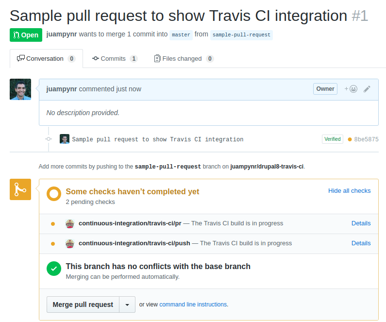

# Travis CI sample integration with Drupal 8

This repository contains a sample Drupal 8 project with Continuous Integration
via Travis CI. When a pull request is created against this repository, Travis CI
will add the following status messages:

For you to see the details of each individual job, you will have to click on
Details at the above screenshot, which will show a page similar like the following
one:

If you want to install this into your project, follow instructions at the
[CircleCI installer for Drupal 8](https://github.com/Lullabot/drupal8ci#travis-ci).
